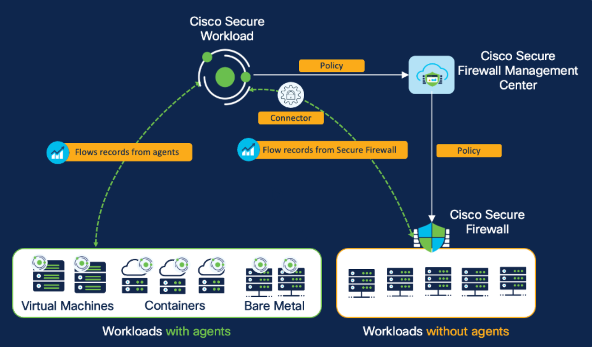

# Cisco Secure Workload + Secure Firewall Integration

**How Secure Workload and Secure Firewall work together to deliver zero-trust
microsegmentation for workloads where a host agent isn't feasible — plus virtual
patching and rapid threat containment.**

Secure Workload's strength is **host-based** enforcement (an agent on the
workload). But agents aren't always possible — legacy OS, mainframes, appliances,
third-party or contractual constraints. The Secure Firewall integration adds a
**network-based** enforcement option so you can segment **agentless** workloads
from the *same* Secure Workload policy model, and layer on **defense-in-depth**
(virtual patching, rapid threat containment).

> **Primary Cisco sources.** Built from three Cisco articles:
> [Overview](https://secure.cisco.com/secure-workload/docs/secure-workload-and-secure-firewall),
> [Topology Awareness](https://secure.cisco.com/secure-workload/docs/secure-workload-compliance),
> and the
> [Deep Dive of Secure Workload & Firewall Integration](https://secure.cisco.com/secure-workload/docs/secure-workload-whitepaper).
> See [`docs/00-official-references.md`](./docs/00-official-references.md).

> **About the diagrams.** This guide embeds the **official Cisco figures** from
> those articles (in [`assets/figures/`](./assets/figures/), grouped by source as
> `overview/`, `topology/`, `deep-dive/`). They are © Cisco Systems, Inc. — see
> [`assets/figures/NOTICE.md`](./assets/figures/NOTICE.md).

---

## Executive overview — 60-second read

- **The problem.** Microsegmentation works best with a host agent, but you can't
  always install one. Network firewalls can segment those workloads — but managed
  separately, they create inconsistent "islands of policy."
- **The integration.** Secure Workload becomes the **single policy brain**. It
  ingests **NSEL** flow telemetry from Secure Firewall for visibility, discovers
  policy with ADM, then **pushes L3/L4 rules to Firewall Management Center (FMC)**
  as **dynamic objects** — so one policy model covers both **agent** (host) and
  **agentless** (network) workloads.
- **Topology Awareness.** Each firewall is mapped to a **Scope**, so only the
  rules relevant to that firewall are pushed — keeping firewall rulebases clean
  and audit-friendly.
- **Three use cases.** (1) **Microsegmentation** of agentless workloads,
  (2) **Virtual patching** (export workload CVEs → FMC IPS recommendations), and
  (3) **Rapid Threat Containment** (FMC detects → quarantines via Secure Workload
  labels).
- **Where to start.** New to it →
  [`docs/01-overview.md`](./docs/01-overview.md). Architecture →
  [`docs/03-architecture-and-visibility.md`](./docs/03-architecture-and-visibility.md).
- **Disclaimer.** Independent practitioner guide; not an official Cisco
  publication. Validate against your CSW/FMC releases.

---

## Host-based vs network-based — one policy, two enforcement styles

*Figure 2 — Host-based and network-based approach with Secure Workload (© Cisco Systems, Inc.)*

| | Host-based (agent) | Network-based (Secure Firewall) |
|---|---|---|
| Enforced at | Workload OS firewall / DPU | East-west Secure Firewall (via FMC) |
| Best for | Workloads you can put an agent on | **Agentless** — legacy OS, appliances, constrained |
| Visibility | Rich: flows + processes + packages + CVEs | NSEL flow records (stateful, bi-directional) |
| Extra telemetry | Process tree, CVEs, MITRE TTPs | — |
| Persona | App / workload owners | **Network / firewall engineers** |

The power is that **both** are authored in the *same* Secure Workload scope/policy
model — no separate policy island.

---

## The three integration use cases

| # | Use case | What it does | Doc |
|---|---|---|---|
| 1 | **Microsegmentation (agentless)** | Ingest NSEL → discover policy → push L3/L4 rules to FMC as dynamic objects | [`03`](./docs/03-architecture-and-visibility.md) · [`04`](./docs/04-fmc-connector-and-policy.md) · [`05`](./docs/05-insertion-options.md) |
| 2 | **Virtual patching** | Export workload CVEs to FMC → Cisco Recommended Rules tune IPS → apply as compensating control | [`06`](./docs/06-virtual-patch.md) |
| 3 | **Rapid Threat Containment** | FMC detects anomaly → correlation policy → remediation module → Secure Workload quarantines via labels | [`07`](./docs/07-rapid-threat-containment.md) |

---

## Repo map

| Topic | Doc |
|---|---|
| Why integrate; host vs network; the 3 use cases | [`docs/01-overview.md`](./docs/01-overview.md) |
| Topology Awareness — scope ↔ firewall mapping | [`docs/02-topology-awareness.md`](./docs/02-topology-awareness.md) |
| Architecture, NSEL/Ingest connector, flow stitching | [`docs/03-architecture-and-visibility.md`](./docs/03-architecture-and-visibility.md) |
| FMC connector, ACP↔scope, merge/override, dynamic objects | [`docs/04-fmc-connector-and-policy.md`](./docs/04-fmc-connector-and-policy.md) |
| Firewall insertion options (L2/L3/ACI, AWS/Azure/GCP) | [`docs/05-insertion-options.md`](./docs/05-insertion-options.md) |
| Virtual patch use case | [`docs/06-virtual-patch.md`](./docs/06-virtual-patch.md) |
| Rapid Threat Containment use case | [`docs/07-rapid-threat-containment.md`](./docs/07-rapid-threat-containment.md) |
| FAQ (supported versions, dual-management, L7) | [`docs/08-faq.md`](./docs/08-faq.md) |
| Jump by question | [`INDEX.md`](./INDEX.md) |

---

## Related repos

- **[CSW-Policy-Lifecycle](https://github.com/chandrapati/CSW-Policy-Lifecycle)** — discovery → analysis → enforcement for policy in general (scopes, rank, inheritance).
- **[CSW-Kubernetes-OpenShift-Guide](https://github.com/chandrapati/CSW-Kubernetes-OpenShift-Guide)** — the host-based story on K8s/OpenShift nodes.
- **[CSW-Agent-Installation-Guide](https://github.com/chandrapati/CSW-Agent-Installation-Guide)** — agent install across platforms.

---

> **Disclaimer.** Independent practitioner documentation. Cisco, Secure Workload,
> Secure Firewall, FMC, and Tetration are trademarks of Cisco Systems, Inc.
> Always confirm behavior against the official documentation in
> [`docs/00-official-references.md`](./docs/00-official-references.md) and your
> licensed releases.
