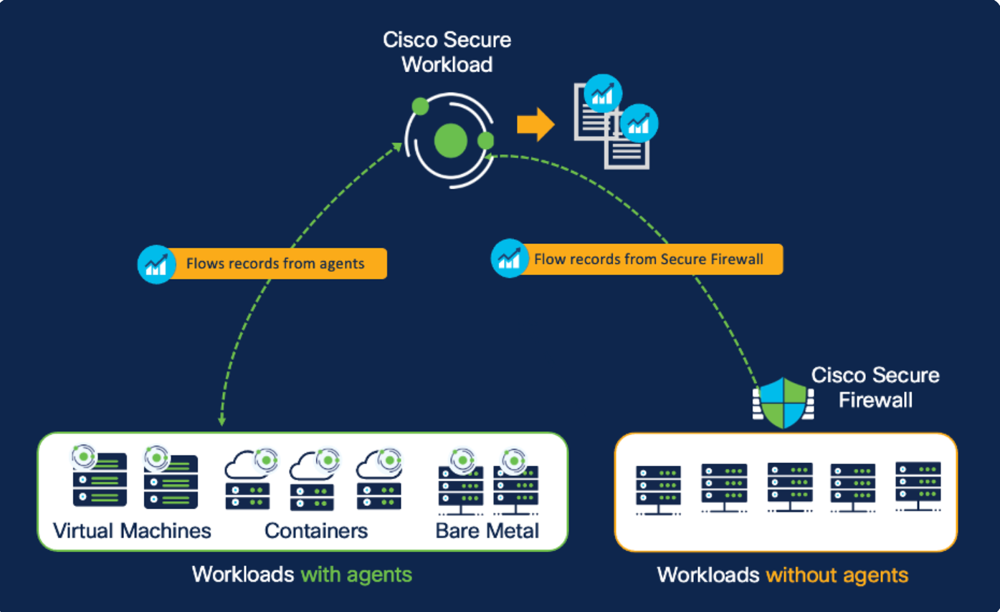
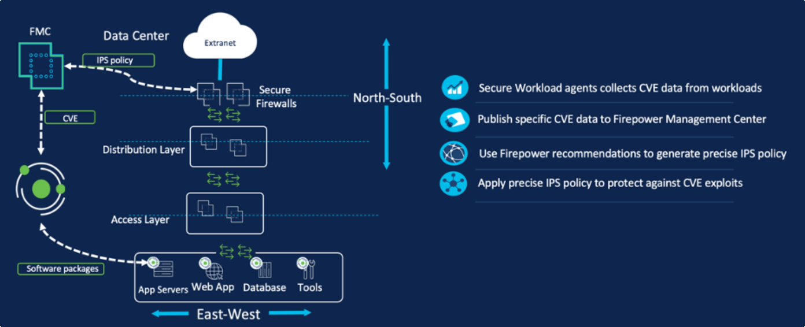

# Overview — host + network enforcement, and the three use cases

> **Cisco source.** [Secure Workload and Secure Firewall — Overview](https://secure.cisco.com/secure-workload/docs/secure-workload-and-secure-firewall).

Zero-trust microsegmentation divides the network into isolated segments, each with
its own policy, so a breach can't move laterally — the blast radius is contained.
There are two broad ways to enforce it, and the Secure Workload + Secure Firewall
integration lets you use **either or both** from one policy model.

| Approach | Where policy is enforced | Notes |
|---|---|---|
| **Host-based** | On the workload itself (agent, or cloud API) | Rich telemetry: processes, packages, CVEs. Not always possible (legacy OS, appliances, org constraints). |
| **Network-based** | On a network device — east-west firewall or switch | Works where an agent can't go. Managed via FMC. |

The pragmatic reality: a **dynamic duo of host + network** enforcement is what makes
zero-trust microsegmentation achievable across a real, heterogeneous estate. Cisco's
native Secure Workload ↔ Secure Firewall integration delivers exactly that, plus
defense-in-depth.

---

## Use Case 1 — Network visibility via an east-west firewall

"What you can't see, you can't protect." Microsegmentation starts with **flow
visibility** — a blueprint of how applications talk to each other, users, and
devices.

The integration ingests **NSEL (NetFlow Secure Event Logging)** flow records from
Secure Firewall, then **enriches** that flow data with context — labels/tags from
CMDB, IPAM, identity sources — so you can quickly spot communication patterns and
indicators of compromise.

*Figure 1 — Secure Workload ingests NSEL flow records from Secure Firewall (© Cisco Systems, Inc.)*

---

## Use Case 2 — Microsegmentation using the east-west firewall

The integration gives two complementary ways to **discover, compile, and enforce**
zero-trust policy — host-based, network-based, or a mix — so you deploy in whatever
way fits your teams and business needs. Regardless of mix, you get the full Secure
Workload capabilities:

- **Policy discovery & analysis** — automatically discover policy by analyzing flow
  data ingested from the firewall protecting east-west traffic.
- **Policy enforcement** — onboard multiple east-west firewalls and push/enforce
  microsegmentation policy to a specific firewall or set of firewalls (this is where
  **Topology Awareness** comes in — see [`02-topology-awareness.md`](./02-topology-awareness.md)).
- **Policy compliance monitoring** — compare live network flows against the baseline
  policy to see how apps behave and comply over time.

*Figure 2 — Host-based and network-based approach with Secure Workload (© Cisco Systems, Inc.)*

---

## Use Case 3 — Defense in depth: virtual patching via a north-south firewall

When a zero-day CVE appears, you often can't patch immediately — either no patch
exists yet, or it isn't worth the downtime outside the maintenance window. **Virtual
patching** is a compensating control: apply an interim "virtual" fix via the
Secure Firewall **IPS** until the real patch lands.

How the integration enables it:

1. Secure Workload **agents** gather telemetry on software packages and CVEs present
   on the workloads.
2. A **workload→CVE mapping** is published to **FMC**. You choose which CVEs to
   publish (e.g. only network-exploitable CVEs with CVSS 10) to control IPS
   performance impact.
3. FMC runs **Cisco Recommended Rules** (formerly Firepower Recommendations) to
   fine-tune and enable exactly the **snort signatures** needed for those CVEs, then
   deploys them to the perimeter (north-south) firewall.

*Figure 3 — Virtual patching with Secure Workload and Secure Firewall (© Cisco Systems, Inc.)*

Full detail in [`06-virtual-patch.md`](./06-virtual-patch.md).

---

## Takeaway

Combining **host-based + network-based** enforcement (plus **virtual patching**)
gives you a zero-trust model with **flexibility** and **defense in depth** — protect
the workloads you can with agents, the ones you can't with the firewall, and add an
IPS safety net for unpatched CVEs, all from one Secure Workload policy.

---

## See also

- [`docs/02-topology-awareness.md`](./02-topology-awareness.md) — how scopes map to firewalls
- [`docs/03-architecture-and-visibility.md`](./03-architecture-and-visibility.md) — NSEL/Ingest connector + flow stitching
- [`docs/06-virtual-patch.md`](./06-virtual-patch.md) · [`docs/07-rapid-threat-containment.md`](./07-rapid-threat-containment.md)
