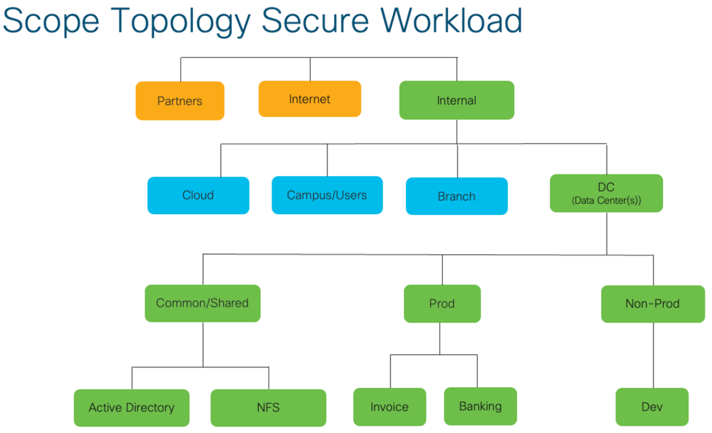
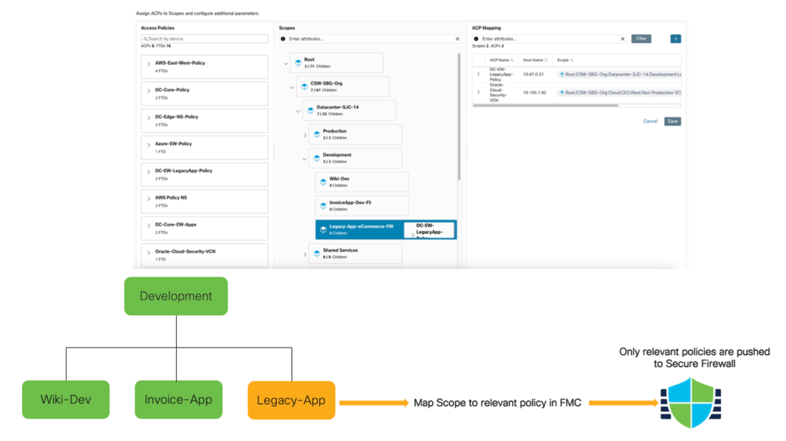

# Topology Awareness — mapping scopes to firewalls

> **Cisco source.** [Secure Workload — Importance of Topology Awareness](https://secure.cisco.com/secure-workload/docs/secure-workload-compliance).

Firewalls have evolved a lot, but on their own they don't stop lateral movement once
an attacker is inside. Vendors moved security closer to the workload — via **agent**
or **agentless** techniques — to build a micro-perimeter. Which to use depends on the
**people, process, technology** triad.

The hard part for network/firewall teams: when a common policy is translated to
machine rules, the translation tends to generate **extra rules**. For agent-based
enforcement that's usually tolerable. For **firewall** enforcement it's a problem —
firewall rulebases are **audited for compliance**, and unnecessary rules create real
consequences.

---

## The three questions

Before choosing an approach, answer:

- **What** are we protecting? (e.g. a finance app, a legacy app)
- **Who** owns the policy? (app/workload team, or network/NetSec team)
- **How** is policy executed? (agent-based, or agentless via firewall)

The integration must support a **common policy** across agent and agentless
workloads — while only pushing the **rules that are actually required** to each
firewall.

---

## Scopes — topology as the source of truth

Secure Workload models topology with **Scopes** — an infrastructure-agnostic tree
that groups applications by context and lets you author policy as human intent
(e.g. *"Production cannot talk to Non-Production"*) that follows the hierarchy.


*Figure 1 — Scope topology in Secure Workload (© Cisco Systems, Inc.)*

The scope tree **is** the topology of your workloads — and it can be shaped per
department/team so each persona's security requirements are reflected.

---

## Topology Awareness — push only what's required

**Topology Awareness** = mapping a workload **Scope** to a specific **firewall** in
the network topology. With that mapping, Secure Workload pushes **only the relevant
policies** for that application to that firewall — via **FMC (Firewall Management
Center)** — avoiding the extra, unnecessary rules that would otherwise break
firewall-rule audit/compliance.

```
   Secure Workload scope tree            Secure Firewalls (via FMC)
   ┌───────────────────────────┐
   │ Production                │  Topology Awareness:
   │  ├── payments  ───────────┼─────────►  FW-A  (only payments-relevant rules)
   │  ├── orders    ───────────┼─────────►  FW-B  (only orders-relevant rules)
   │  └── shared-svcs          │
   └───────────────────────────┘
```


*Figure 2 — FMC connector and scope-to-Access-Control-Policy mapping (© Cisco Systems, Inc.)*

Execution: with the scope mapped, Secure Workload pushes the relevant policy to the
Secure Firewall via **FMC**. Only the required rules are sent — preserving compliance
and keeping FMC- and Secure-Workload-authored policy coexisting cleanly. The
mechanics of that ACP↔Scope mapping (merge/override, rule ordering, parent vs child
scope) are in [`04-fmc-connector-and-policy.md`](./04-fmc-connector-and-policy.md).

---

## Why it matters

With Topology Awareness you can:

- **Meet compliance/audit requirements** for firewall rules (no junk rules).
- **Protect and leverage existing investment** in network firewalls.
- **Operationalize zero-trust microsegmentation** using both agent and agentless
  approaches — from one solution, adapting to each persona (NetSec, app owners,
  cloud architects).

---

## See also

- [`docs/04-fmc-connector-and-policy.md`](./04-fmc-connector-and-policy.md) — ACP↔scope mapping mechanics
- [`docs/01-overview.md`](./01-overview.md) — host vs network enforcement
- [`docs/05-insertion-options.md`](./05-insertion-options.md) — where the firewall sits in the datapath
