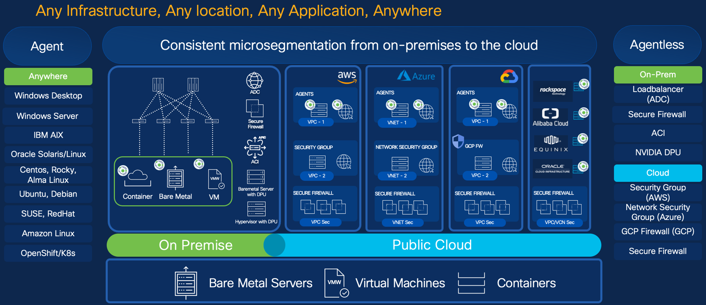
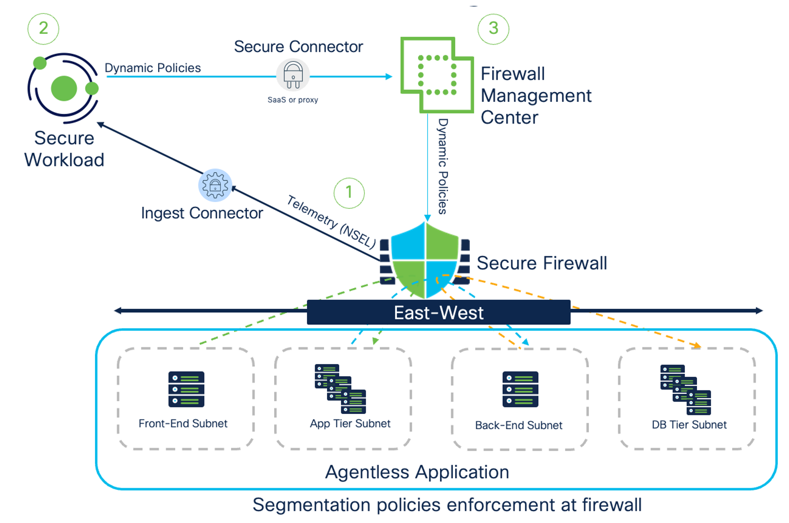
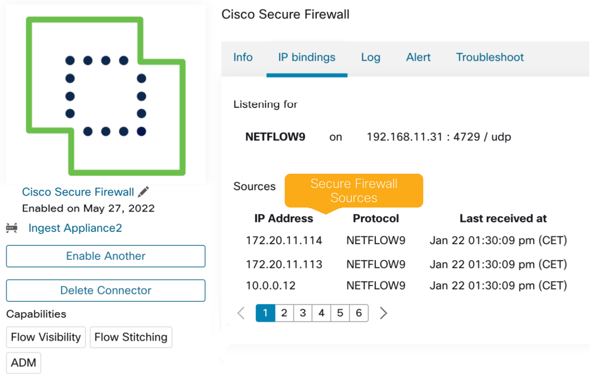
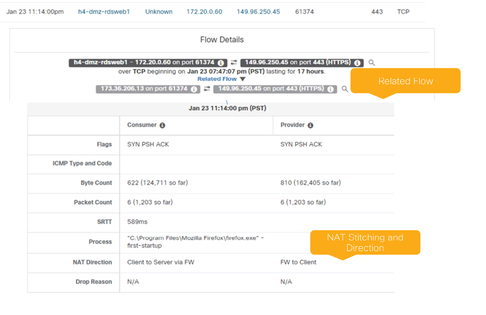

# Architecture & visibility — NSEL, the Ingest Connector, flow stitching

> **Cisco source.** [Deep Dive of Secure Workload & Firewall Integration](https://secure.cisco.com/secure-workload/docs/secure-workload-whitepaper).

## Where this fits in the Secure Workload solution

Secure Workload focuses on three use cases. The Secure Firewall integration touches
all three (microsegmentation, vulnerability/virtual-patch, behavioral/RTC):

- **Zero-trust microsegmentation** — discover workloads by labels, auto-discover and
  suggest policy from flows, validate without operational impact, and enforce across
  multiple points: **host firewalls, DPUs, network firewalls, load-balancers, and
  cloud-native controls**.
- **Vulnerability detection & protection** — the agent detects vulnerable packages
  and container images; CVE-attributed policy can quarantine workloads or drive a
  **virtual patch via Secure Firewall**.
- **Behavioral detection & protection** — process tree/snapshots and anomalous
  behavior (MITRE ATT&CK TTPs or custom forensic rules); with Secure Firewall this
  enables **Rapid Threat Containment** for agent *and* agentless workloads.

*Figure 1 — Secure Workload solution (© Cisco Systems, Inc.)*

---

## High-level architecture

The microsegmentation use case targets **east-west** flows to workloads where an
agent isn't feasible. Three capabilities make it work: **(1)** agentless
**visibility** (this doc), **(2)** the Secure Workload **dynamic policy engine**
pushing to FMC ([`04`](./04-fmc-connector-and-policy.md)), and **(3)** firewall
**insertion** in the datapath ([`05`](./05-insertion-options.md)).

*Figure 2 — Secure Workload and Secure Firewall high-level architecture (© Cisco Systems, Inc.)*

---

## Visibility of agentless workloads — NSEL

For workloads with no agent, Secure Workload gets flow visibility by ingesting
**NSEL (NetFlow Secure Event Logging)** from Secure Firewall. NSEL provides
**stateful IP flow tracking**, accounting for the **bi-directionality** of flows.
Workloads are then auto-discovered using manual labels or external label sources
(CMDB, IPAM).

### The Ingest Connector

NSEL events stream to the Secure Workload **Ingest Connector**, which processes them
and exports the flow data into Secure Workload.

- Scales to **45k fps per individual Secure Firewall connector**.
- Up to **135k fps total per appliance** (on-prem).

*Figure 3 — Secure Firewall connector (© Cisco Systems, Inc.)*

### Flow stitching (end-to-end visibility through NAT)

Secure Workload can **stitch related flows** to reconstruct **end-to-end** visibility
even when **NAT** is performed along the path — so a NAT'd conversation still resolves
to the true source/destination workloads.

*Figure 4 — Flow stitching with Secure Firewall (© Cisco Systems, Inc.)*

---

## Connectivity note (SaaS / behind a proxy)

If Secure Workload is the **SaaS** offering, or sits **behind a proxy**, reaching FMC
to push policy requires the **Secure Connector**. (Visibility ingest and policy push
are separate paths — see [`04`](./04-fmc-connector-and-policy.md).)

---

## See also

- [`docs/04-fmc-connector-and-policy.md`](./04-fmc-connector-and-policy.md) — discovery, FMC onboarding, ACP↔scope, dynamic objects
- [`docs/05-insertion-options.md`](./05-insertion-options.md) — L2/L3/ACI and cloud insertion
- [`docs/01-overview.md`](./01-overview.md) — the three use cases at a glance
