# FMC connector & policy — discovery, ACP↔scope mapping, dynamic objects

> **Cisco source.** [Deep Dive of Secure Workload & Firewall Integration](https://secure.cisco.com/secure-workload/docs/secure-workload-whitepaper).

This is the heart of network-based enforcement: how Secure Workload **discovers**
policy from ingested flows and **pushes** it to Secure Firewall through **FMC**.

---

## 1. Policy discovery & analysis (ADM)

You can author policy manually, or run **automatic discovery with ADM (Application
Dependency Mapping)** over the ingested flow data — using ML/behavioral algorithms.
Discovered policy can be **tested and validated** before enforcement.

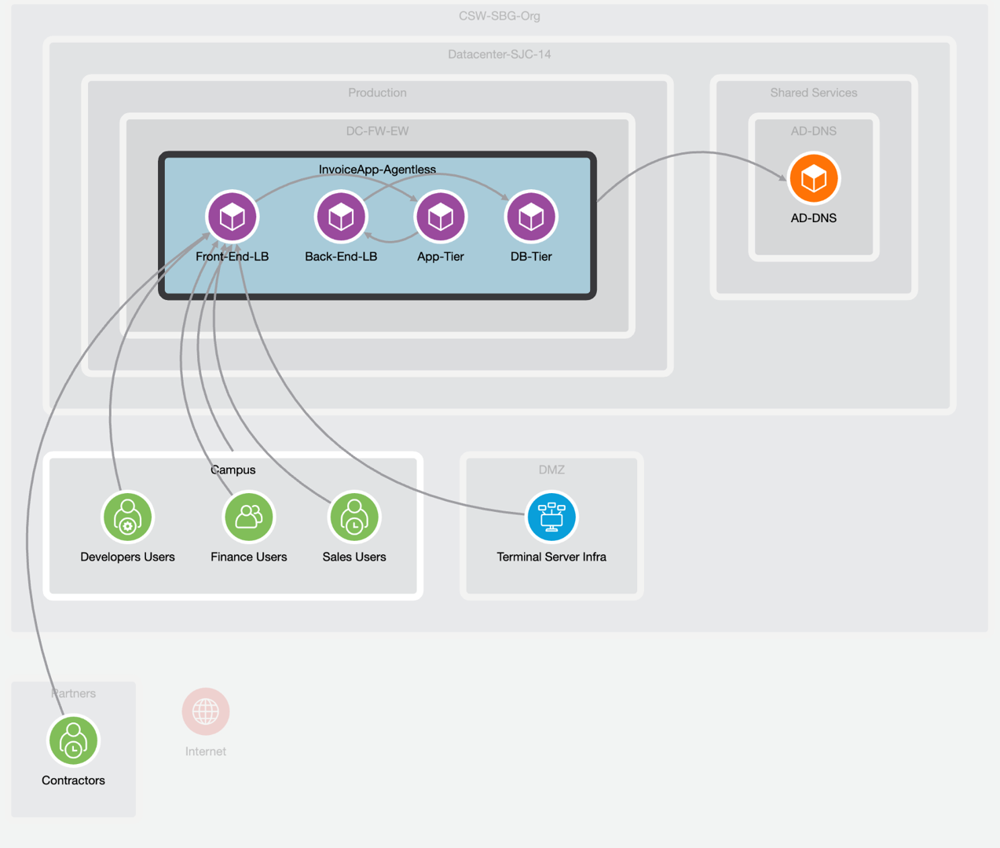
*Figure 5 — Application dependencies discovered by Secure Workload (© Cisco Systems, Inc.)*

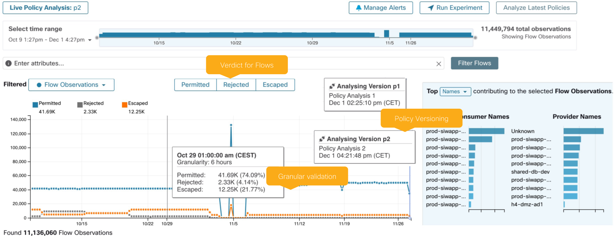
*Figure 6 — Secure Workload policy analysis toolkit (© Cisco Systems, Inc.)*

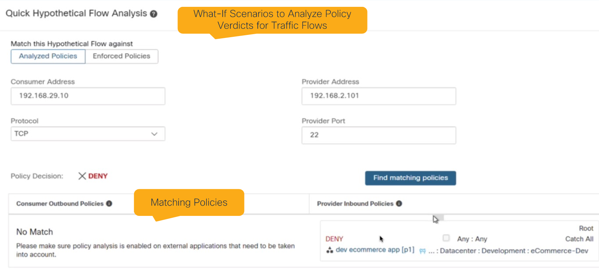
*Figure 7 — Policy flow analysis (© Cisco Systems, Inc.)*

---

## 2. FMC connector — onboarding firewalls

Before enforcing, east-west firewalls are **onboarded through the FMC connector**.
It supports **single-domain and multi-domain** FMC deployments. The REST-API user
configured for Secure Workload must have **administrative privileges**.

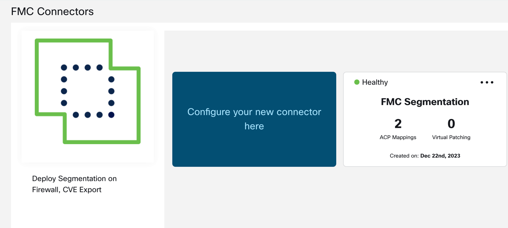
*Figure 8 — FMC connector (© Cisco Systems, Inc.)*

Onboarding happens on an **Access Control Policy (ACP)** basis — by **mapping an ACP
to a Scope** (Topology Awareness). Each ACP↔Scope mapping has tunable behavior:

| Setting | Options | Meaning |
|---|---|---|
| **Enforcement mode** | **Merge** / **Override** | *Merge* honors existing FMC rules (dual-management). *Override* removes any non-CSW rule — only CSW-pushed rules remain. |
| **Rule ordering** | **Top** / **Bottom** | CSW rules placed above or below existing FMC rules. CSW **Default** policies → FMC **Default** category; CSW **Absolute** policies → FMC **Mandatory** category. |
| **Catch-all** | CSW catch-all / FMC default action | Use Secure Workload's catch-all, or keep the firewall's existing default action. |

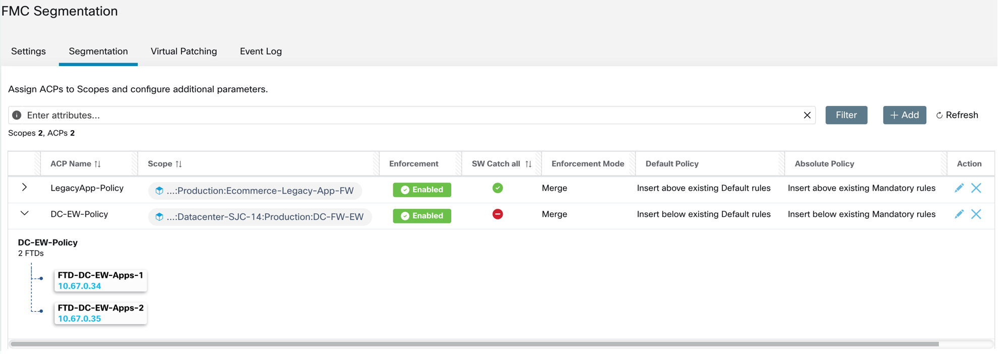
*Figure 9 — FMC connector segmentation use-case (© Cisco Systems, Inc.)*

---

## 3. ACP-to-Scope mapping — single vs multiple applications

There are **two ways** to map an ACP to a Scope, depending on how many applications a
firewall protects:

| Mapping | When | What gets pushed |
|---|---|---|
| **Child / leaf scope** (single app) | One application behind the firewall | Only the **child scope** policies + any **parent guardrails**. |
| **Parent scope** (multiple apps) | Several applications behind the firewall | The **mapped scope** rules **plus** policies from child/leaf scopes **below** it (hierarchical policy) + parent guardrails. |

> **Rule:** only **one Scope** can map to **one ACP** (see [`08-faq.md`](./08-faq.md)).

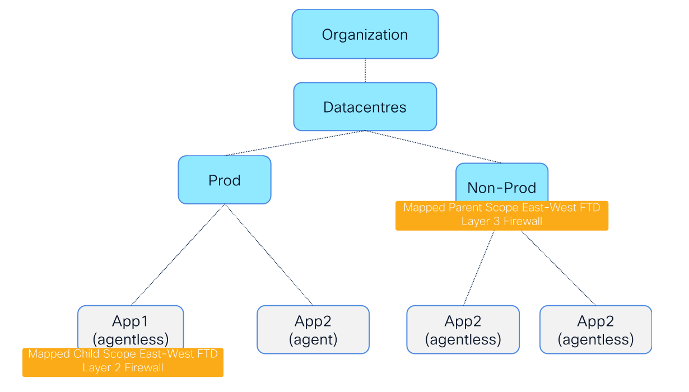
*Figure 10 — Example of scope tree topology (© Cisco Systems, Inc.)*

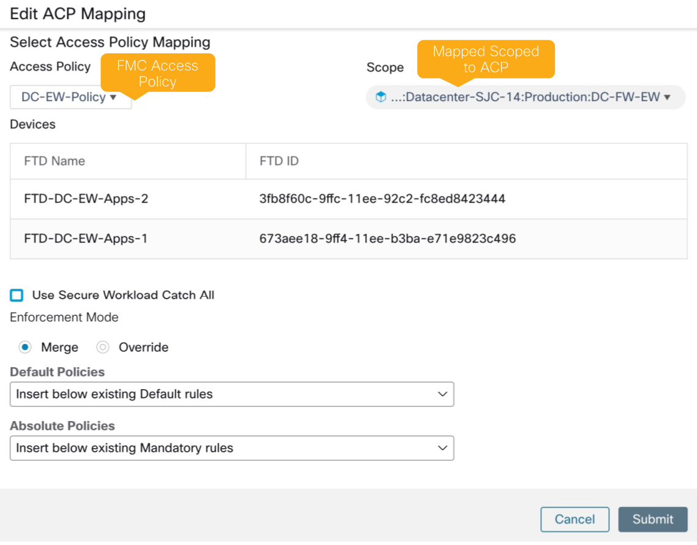
*Figure 11 — Example ACP-to-scope mapping to a parent scope (© Cisco Systems, Inc.)*

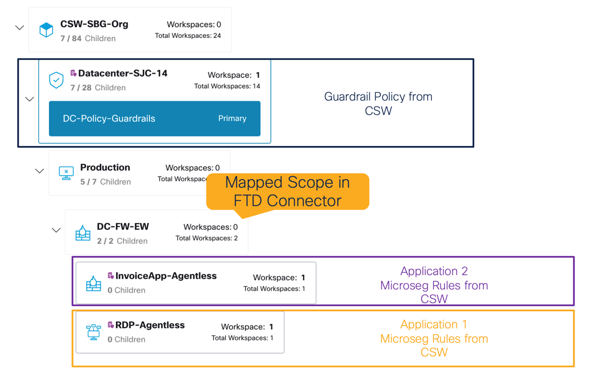
*Figure 12 — Scope structure / mapped scope onboarding multiple applications (© Cisco Systems, Inc.)*

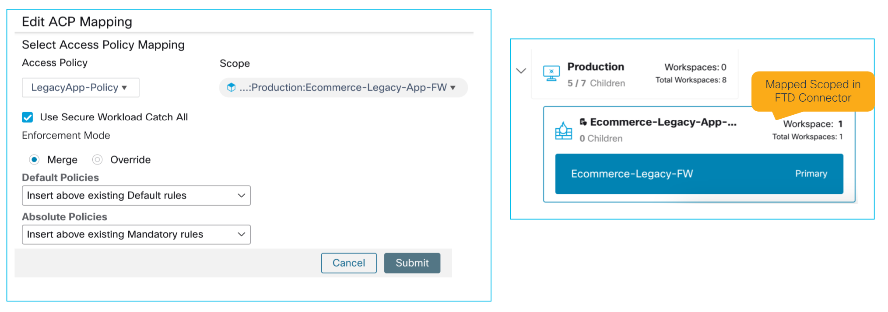
*Figure 13 — Example ACP↔scope mapping for a single application (© Cisco Systems, Inc.)*

---

## 4. Enforcement on FMC via dynamic objects

Policies orchestrated from Secure Workload use **FMC dynamic objects**, so the policy
is **dynamic** — if an object's membership changes, **no policy redeploy** is needed.
FMC pushes the orchestrated dynamic policies to the relevant Secure Firewalls.

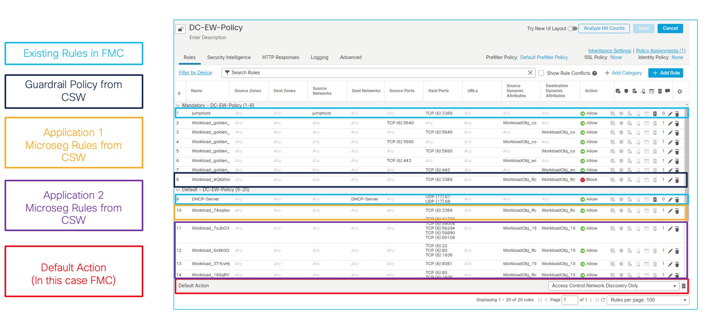
*Figure 14 — Multiple Secure Workload application policies pushed to FMC (© Cisco Systems, Inc.)*

---

## 5. Compliance monitoring

Policy is **continuously monitored** for compliance. Alerts and reports can be
generated for **deviation conditions** (e.g. rejected flows) so anomalies can be
investigated and mitigated quickly.

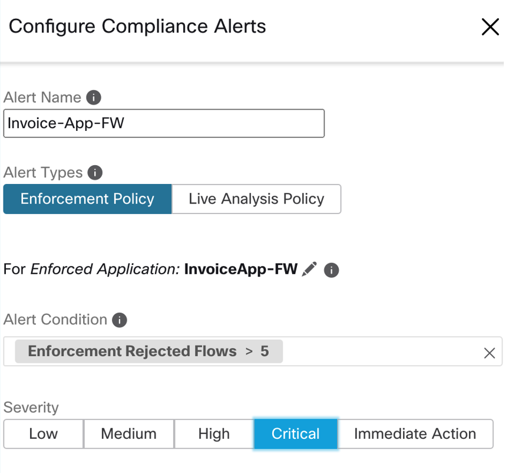
*Figure 15 — Compliance alerts for rejected flows (© Cisco Systems, Inc.)*

---

## See also

- [`docs/02-topology-awareness.md`](./02-topology-awareness.md) — the *why* behind scope↔firewall mapping
- [`docs/05-insertion-options.md`](./05-insertion-options.md) — where the firewall sits in the path
- [`docs/08-faq.md`](./08-faq.md) — supported versions, dual-management, L7 limits
