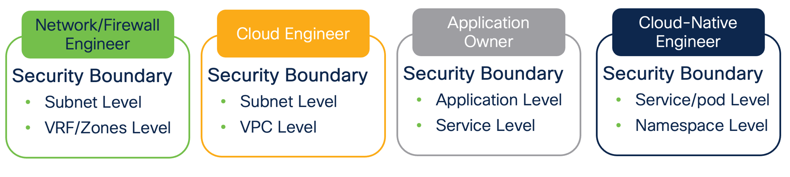
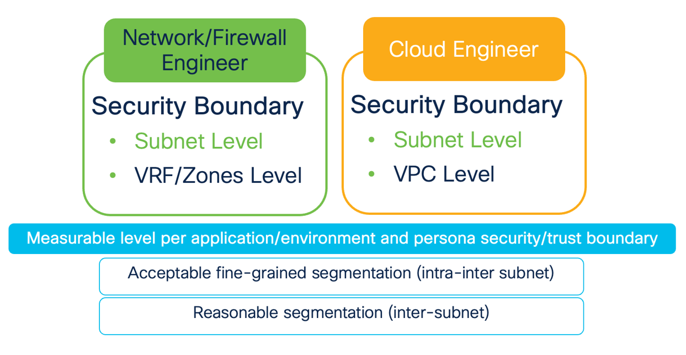
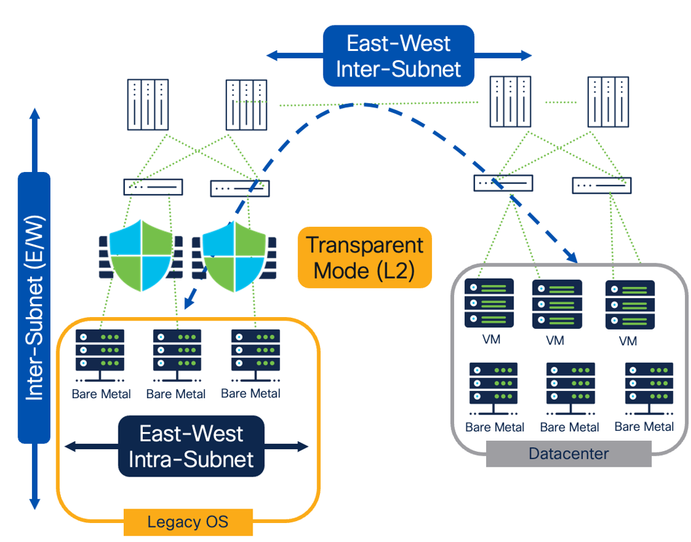
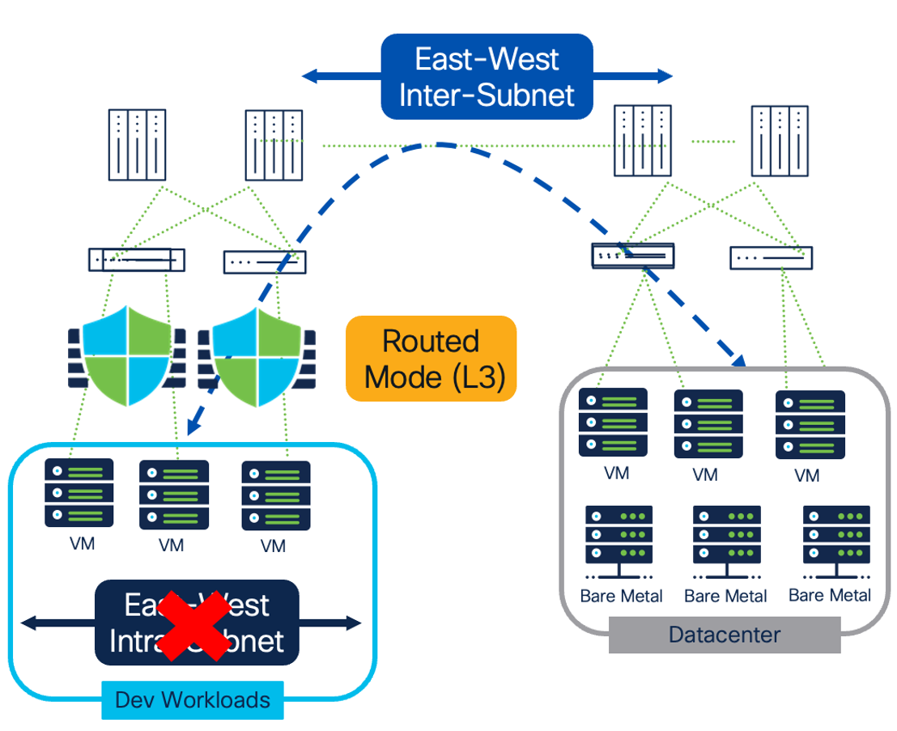
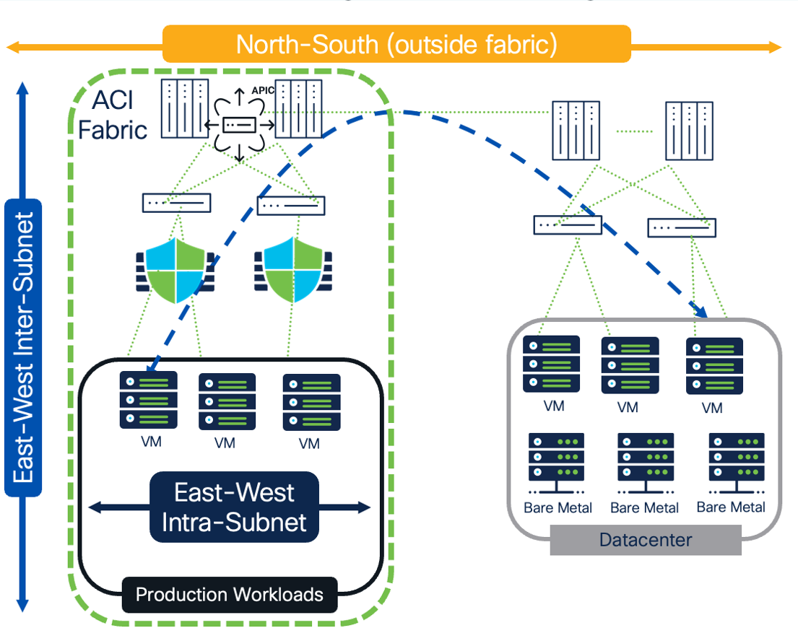
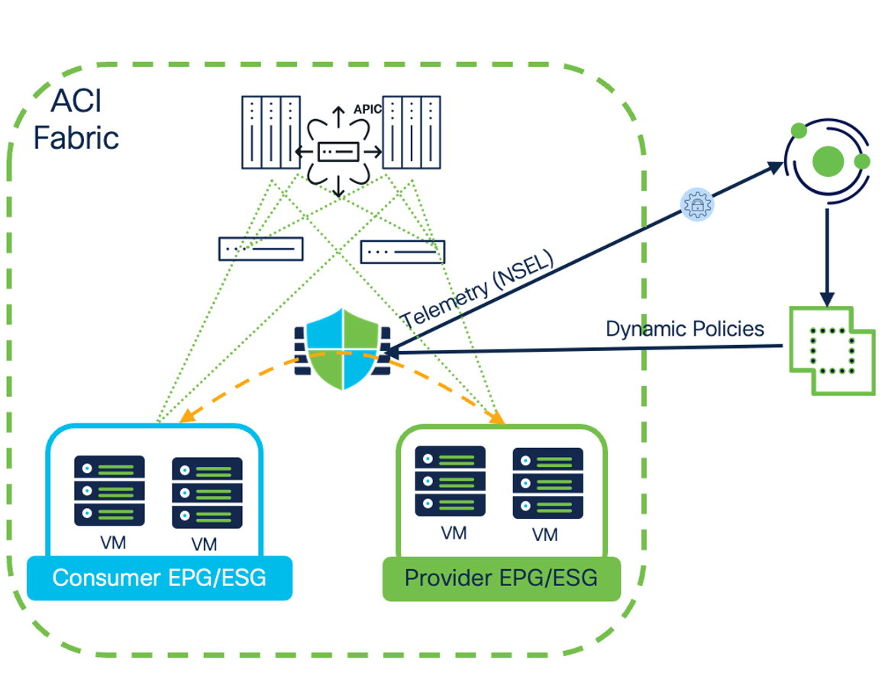
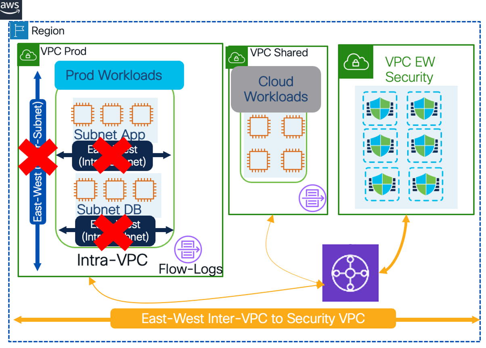
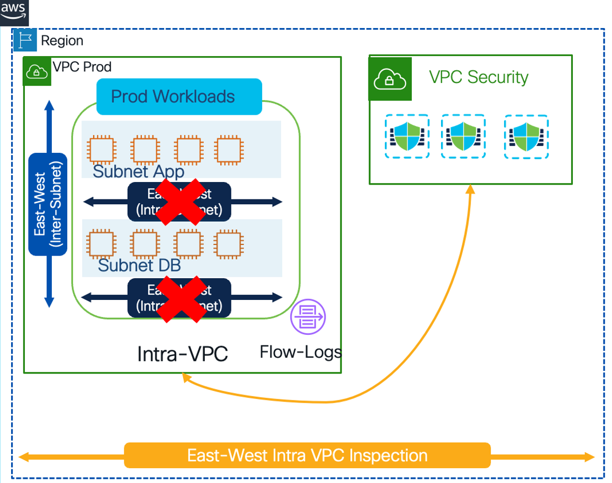
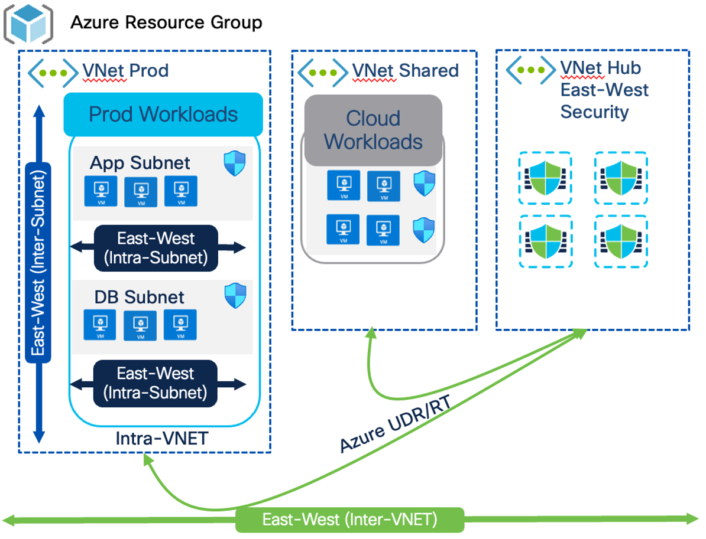
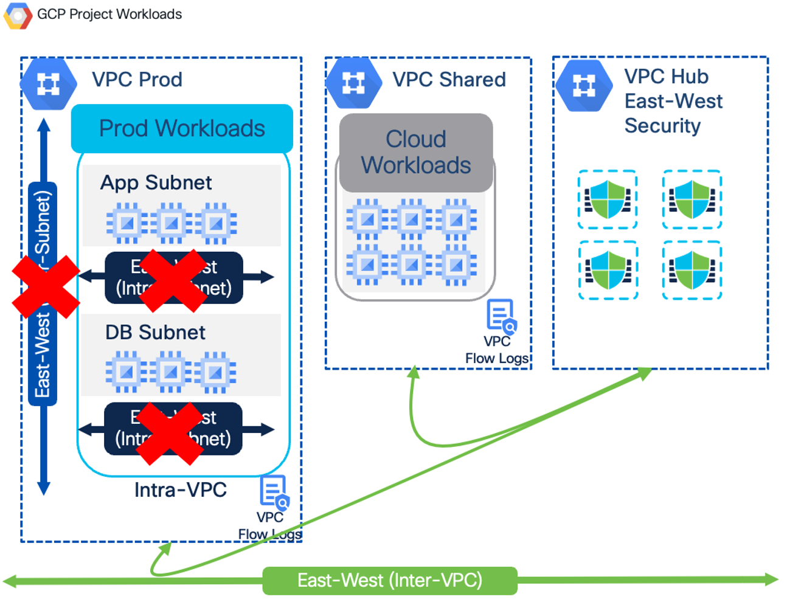

# Firewall insertion options — on-prem & cloud

> **Cisco source.** [Deep Dive of Secure Workload & Firewall Integration](https://secure.cisco.com/secure-workload/docs/secure-workload-whitepaper).

Where the firewall sits in the datapath determines what you can **see** (flow
visibility) and what you can **protect** (intra-subnet vs inter-subnet). This doc
summarizes the insertion options and their trade-offs.

---

## First: define the Workload Protection Level

Before picking an insertion mode, define the **workload protection level** based on
each persona's security/trust boundary. Why it's worth doing:

- **Simplicity & abstraction** — bridges business and technical requirements; hides
  the complexity of heterogeneous environments so outcomes are trackable.
- **Common language across personas** — microsegmentation means different things to
  different teams; a shared definition is understood org-wide.
- **Consistency** — persona-based boundaries yield consistent network controls and a
  shared understanding of their limits.
- **Guides approach selection** — agent-based fits non-network constructs;
  agentless fits personas whose trust boundary *is* network-based.

*Figure 16 — Workload protection level definition by persona security/trust boundary (© Cisco Systems, Inc.)*

For the whitepaper's examples, the personas are **Network/Firewall** and **Cloud**
engineers, and the protection boundary is the **subnet level**.

*Figure 17 — Reference measurable workload protection level (© Cisco Systems, Inc.)*

---

## On-premises insertion options

### Layer 2 firewall (transparent mode)

*Figure 18 — Agentless microsegmentation with a Layer 2 (transparent) firewall (© Cisco Systems, Inc.)*

- Best fit for **localized workloads**; acceptable for **fine-grained** segmentation.
- FW is a **bump-in-the-wire** on the datapath — good when an agent can't be
  installed (e.g. **legacy OS**).
- **Full** flow visibility with NSEL — **intra- and inter-subnet**.
- Protection **intra-subnet (App↔App)** and **inter-subnet (App↔App, External↔App)**.
- Allows **policy dual-management** (CSW-owned + FMC-owned). Good fit for **network /
  firewall engineers**.

### Layer 3 firewall (routed mode)

*Figure 19 — Agentless microsegmentation with a Layer 3 (routed) firewall (© Cisco Systems, Inc.)*

- Excellent fit for **distributed workloads**; FW acts as **gateway**.
- **Quick time-to-segment** — good where fine-grained isn't needed (e.g.
  non-prod/dev).
- Protection and visibility are **inter-subnet only** (App↔App, External↔App).
- Allows dual-management. Good fit for network/firewall engineers.

### ACI insertion (Application Centric Infrastructure)

*Figure 20 — Agentless microsegmentation in ACI (© Cisco Systems, Inc.)*

ACI offers multiple ways to insert the firewall:

- **Service Graph with Policy-Based Redirect (PBR)** — no re-architecture, flexible;
  FW selectively inserted in the path; supports **L2 and L3** modes (L3 preferred);
  intra- and inter-subnet visibility + protection; can do **intra-ESG redirection**.
- **Service Graph Go-To / Go-Through** — FW is in-path (security over connectivity),
  less flexible, more complex; typically **north-south**. *Go-To*: inter-subnet
  visibility/protection. *Go-Through*: intra- **and** inter-subnet.

*Figure 21 — Agentless microsegmentation with Service Graph PBR in ACI (© Cisco Systems, Inc.)*

PBR insertion gives flexible, acceptably fine-grained segmentation; **full** NSEL
visibility; intra/inter **EPG/ESG** protection; and **policy multi-management**
(CSW + FMC + ACI owned). Good fit for **network (ACI) and firewall engineers**.

---

## Cloud insertion options

| Cloud | Model | Visibility | Protection scope |
|---|---|---|---|
| **AWS** | **Centralized / Hub VPC** (Fig 22) | Full — VPC flow logs **+** NSEL, intra & inter-subnet | Inter-VPC / inter-subnet (App↔App, External↔App) |
| **AWS** | **Distributed VPC** (Fig 23) | Full — VPC flow logs + NSEL | Intra-VPC / inter-subnet (App↔App, External↔App) |
| **Azure** | **Hub VNet** (Fig 24), Azure UDR | Full — NSG flow logs + NSEL | Intra-VNet (intra & inter-subnet, App↔App) + Inter-VNet (App↔App, External↔App) |
| **GCP** | **Hub VPC** (Fig 25) | Full — VPC flow logs + NSEL | Inter-VPC / inter-subnet (App↔App, External↔App) |

All four support **FMC dual-management**: **east-west** (CSW + FMC) and
**north-south** ingress/egress (FMC). All suit **network / firewall engineers**.

*Figure 22 — AWS centralized / hub-VPC Secure Firewall deployment (© Cisco Systems, Inc.)*

*Figure 23 — AWS distributed-VPC Secure Firewall deployment (© Cisco Systems, Inc.)*

*Figure 24 — Azure hub-VNet Secure Firewall deployment (© Cisco Systems, Inc.)*

*Figure 25 — GCP hub-VPC Secure Firewall deployment (© Cisco Systems, Inc.)*

---

## Quick chooser

| If you need… | Consider |
|---|---|
| Fine-grained intra-subnet on legacy OS, localized | **L2 transparent** |
| Fast inter-subnet segmentation, distributed, non-prod | **L3 routed** |
| Flexible insertion in an ACI fabric | **Service Graph PBR (L3 preferred)** |
| Cloud east-west with central inspection | **Hub VPC/VNet** (AWS/Azure/GCP) |

---

## See also

- [`docs/04-fmc-connector-and-policy.md`](./04-fmc-connector-and-policy.md) — how policy reaches these firewalls
- [`docs/03-architecture-and-visibility.md`](./03-architecture-and-visibility.md) — NSEL ingest behind the visibility claims
