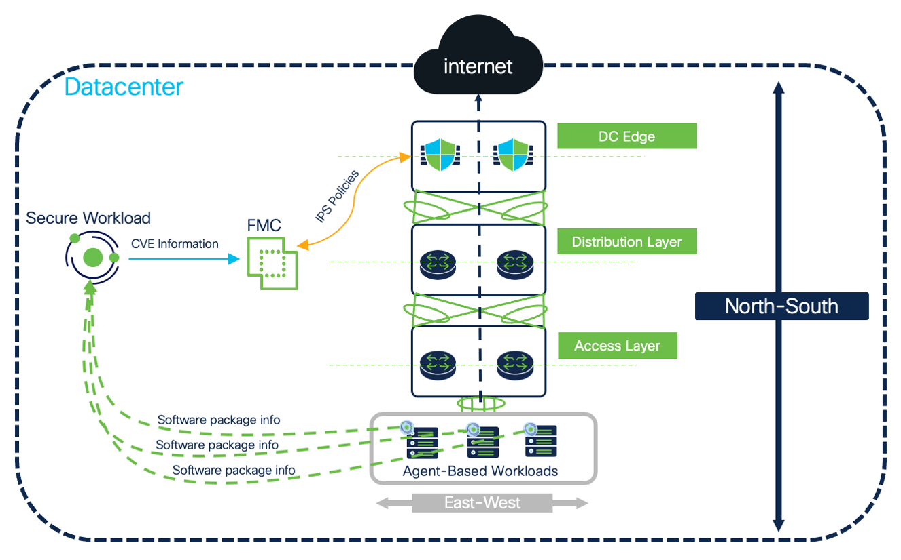
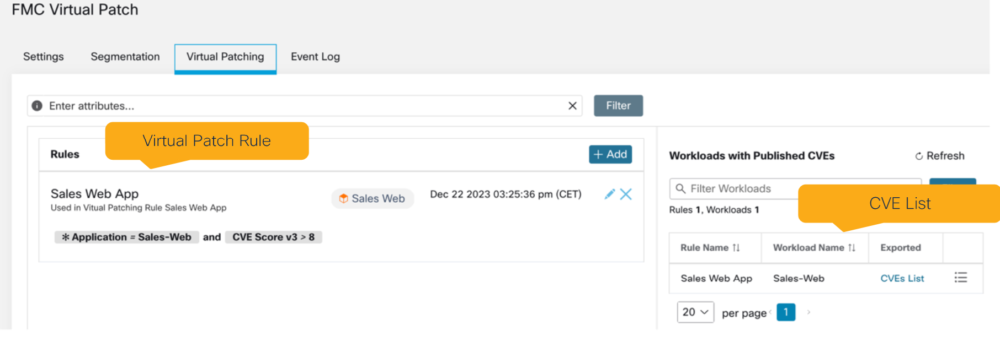
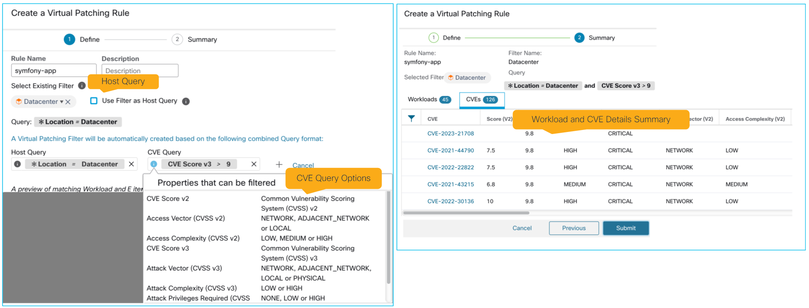
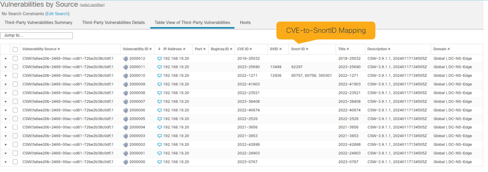
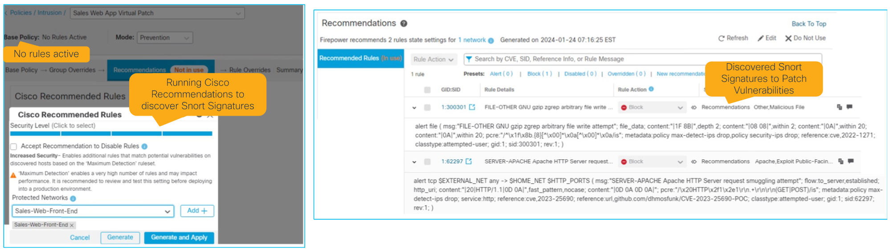
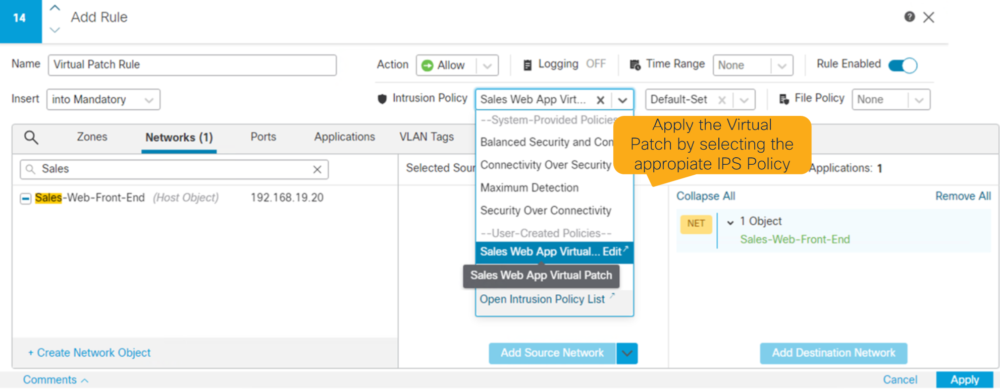

# Virtual patch use case

> **Cisco source.** [Deep Dive of Secure Workload & Firewall Integration](https://secure.cisco.com/secure-workload/docs/secure-workload-whitepaper).

When a CVE can't be patched immediately, **virtual patching** applies an interim
compensating control via the Secure Firewall **IPS** until the real fix lands.

The Secure Workload **agent** delivers in-depth runtime visibility:

- Running processes, process snapshots, process tree, process hash
- Software packages
- Software **and kernel** package **vulnerabilities (CVEs)**

Secure Workload **exports CVE info** to FMC via the FMC connector. The FMC admin then
runs **Cisco Recommended Rules** to fine-tune IPS policy and apply a virtual patch
for important, not-yet-patchable vulnerabilities.

*Figure 26 — Secure Workload + Secure Firewall virtual-patch high-level architecture (© Cisco Systems, Inc.)*

---

## 1. Vulnerabilities export

The FMC connector handles **both** use cases (microsegmentation and virtual patch);
the virtual patch use case has its **own tab** where the relevant rules are created.

*Figure 27 — FMC connector virtual-patch use-case (© Cisco Systems, Inc.)*

A **virtual patch rule** has two parts:

| Element | Purpose |
|---|---|
| **Host query** | Selects **which workloads** to export vulnerabilities from |
| **CVE query** | Selects **which CVEs** for those workloads |

This lets you control IPS impact — e.g. publish only network-exploitable, CVSS-10
CVEs.

*Figure 28 — Example virtual-patch rule definition (© Cisco Systems, Inc.)*

---

## 2. FMC vulnerability import / visibility

Secure Workload exports vulnerabilities into FMC's **Third-Party Vulnerabilities** —
useful for FMC admins and SecOps to see workload hygiene. For CVEs that have an
available snort signature, the **CVE-to-SnortID** mapping is shown.

*Figure 29 — Exported vulnerabilities from Secure Workload to FMC (© Cisco Systems, Inc.)*

---

## 3. Cisco Recommended Rules — discover snort signatures

With CVE intelligence in FMC, run **Cisco Recommended Rules** (formerly Firepower
Recommendations) to auto-discover snort signatures that mitigate the applicable CVEs.
Two approaches:

| Option | Use when |
|---|---|
| **No rules active** | You want a **fine-tuned** IPS policy — only signatures that map to a discovered CVE are enabled. |
| **Selected base policy** | You also want baseline coverage — start from a Cisco base policy (*Connectivity Over Security*, *Balanced Security and Connectivity*, *Maximum Detection*) or a custom one, **plus** the recommended CVE-mapped signatures. |

*Figure 30 — Discovering snort signatures with Cisco Recommended Rules (© Cisco Systems, Inc.)*

---

## 4. Apply the virtual patch

To apply the compensating control, **create/modify an Access Control rule** in the
ACP and add the **Intrusion Policy**, selecting the virtual-patch IPS policy.

*Figure 31 — Applying the virtual patch to an Access Control rule (© Cisco Systems, Inc.)*

---

## Version note

Virtual patch requires **FMC ≥ 7.2** (dynamic objects need ≥ 7.0.1). See
[`08-faq.md`](./08-faq.md).

## See also

- [`docs/01-overview.md`](./01-overview.md) — virtual patch in context (north-south)
- [`docs/07-rapid-threat-containment.md`](./07-rapid-threat-containment.md) — the behavioral-response sibling
