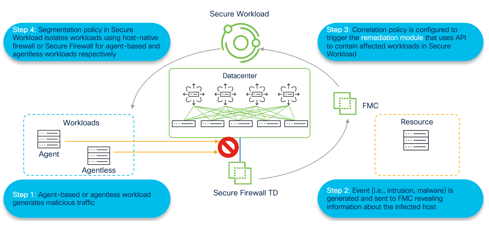
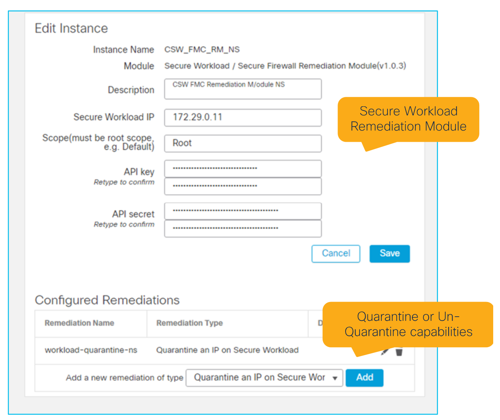
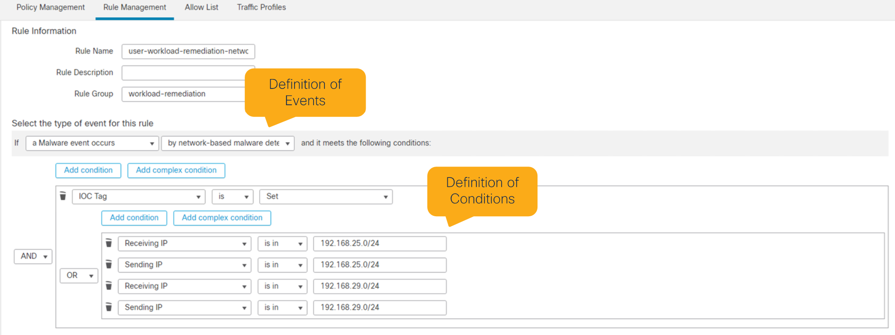
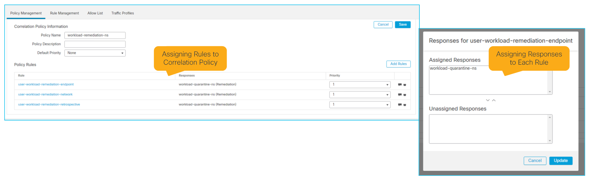
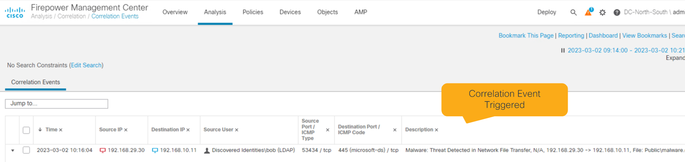
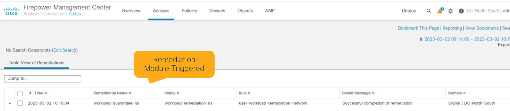
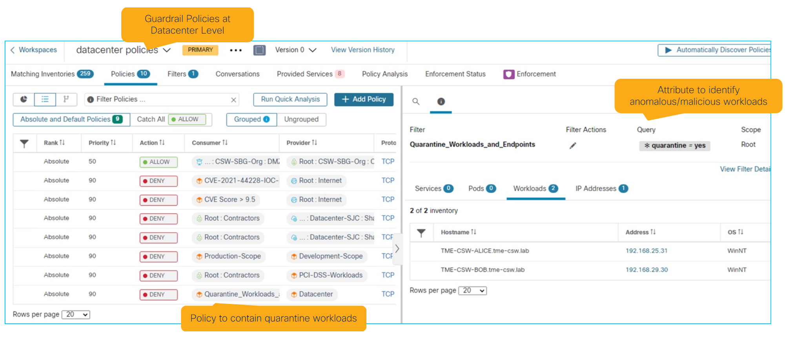

# Rapid Threat Containment (RTC) use case

> **Cisco source.** [Deep Dive of Secure Workload & Firewall Integration](https://secure.cisco.com/secure-workload/docs/secure-workload-whitepaper).

Rapid Threat Containment lets network security/ops teams **quickly identify and
quarantine** a compromised workload when anomalous behavior is detected — a malware
event, intrusion event, correlation event, etc.

---

## The four-step flow

1. **Anomalous workload behavior** — an agent or agentless workload changes behavior
   and generates anomalous/malicious traffic.
2. **Secure Firewall detection** — the firewall detects the change, blocks the flow
   (if configured), and sends an **event to FMC** with the workload details.
3. **FMC orchestration** — a preconfigured **correlation policy** tracking those
   conditions orchestrates a **response via API to Secure Workload**.
4. **Secure Workload policy** — a predefined policy carrying the **quarantine
   attribute/label** (auto-updated via FMC) propagates across enforcement points —
   **agent-based** host firewalls and **agentless** Secure Firewalls — to contain
   lateral movement.

*Figure 32 — Rapid Threat Containment with Secure Workload and Secure Firewall (© Cisco Systems, Inc.)*

---

## FMC Remediation Module for Secure Workload

The **Remediation Module** automates responses based on anomalous/malicious behavior
seen in flows or endpoints. Install it by downloading the package and uploading to
FMC, then minimal config: **Secure Workload cluster IP**, **root scope**, and the
**API key**. The only Secure Workload permission required is **"User Data Upload."**

*Figure 33 — FMC Remediation Module for Secure Workload (© Cisco Systems, Inc.)*

---

## Correlation rules and policy

**Correlation rules** are events/signals FMC tracks; complex conditions are built with
**AND/OR** operators.

*Figure 34 — Correlation rules definitions (© Cisco Systems, Inc.)*

Rules are grouped into a **correlation policy**, each with a **priority** and an
**assigned response**.

*Figure 35 — Correlation policy and assigned responses (© Cisco Systems, Inc.)*

---

## Events workflow

When a correlation **rule** condition is met → it triggers the correlation
**policy** → which initiates the **response** → the **Remediation Module** orchestrates
to Secure Workload, sending the affected workload/endpoint **IPs** via API for use in
segmentation policy.

*Figure 36 — Example correlation event triggered (© Cisco Systems, Inc.)*

*Figure 37 — Remediation module response triggered (© Cisco Systems, Inc.)*

---

## Secure Workload guardrail policy

With Secure Workload's intent-based, **label-driven** policy, guardrails auto-discover
workloads and shrink the attack surface. RTC enables:

- **Quarantine workloads** — block access to agent or agentless workloads showing
  anomalous/malicious behavior.
- **Deny compromised users/endpoints** — block access from compromised
  users/endpoints to applications on-prem or multi-cloud.

*Figure 38 — Example guardrail policies on Secure Workload (© Cisco Systems, Inc.)*

---

## See also

- [`docs/06-virtual-patch.md`](./06-virtual-patch.md) — the CVE-driven compensating-control sibling
- [`docs/04-fmc-connector-and-policy.md`](./04-fmc-connector-and-policy.md) — label/dynamic-object plumbing RTC relies on
